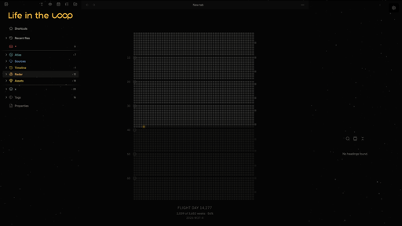

<!-- START doctoc generated TOC please keep comment here to allow auto update -->
<!-- DON'T EDIT THIS SECTION, INSTEAD RE-RUN doctoc TO UPDATE -->
## Contents

- [Skywalker](#skywalker)
  - [1 Installation](#1-installation)
  - [2 Colours](#2-colours)
  - [3 Settings](#3-settings)
  - [4 The companion plugin](#4-the-companion-plugin)
  - [5 Quality](#5-quality)
  - [6 Privacy](#6-privacy)
  - [7 Development](#7-development)
  - [8 Credits](#8-credits)
  - [9 License](#9-license)

<!-- END doctoc generated TOC please keep comment here to allow auto update -->

# Skywalker

A dark theme for Obsidian, built on Catppuccin's palettes.



## 1 Installation

Not in Obsidian's community theme catalogue yet: a theme is submitted there after
its first release, and appears once that submission has been reviewed. Until then,
either route below installs it.

- **BRAT** — install [BRAT](https://github.com/TfTHacker/obsidian42-brat), then add
  `theloop-am/obsidian-skywalker` as a beta theme.
- **By hand** — download `theme.css` and `manifest.json` from the
  [latest release](https://github.com/theloop-am/obsidian-skywalker/releases/latest)
  and put them in `<vault>/.obsidian/themes/Skywalker/`.

Requires Obsidian 1.13.0 or later.

## 2 Colours

Every Catppuccin flavour is built in, light and dark, and each accent can be set
on its own. AMOLED is one of them: true black rather than a dark grey, for screens
where that is the difference between dark and off.

The `snippets/` folder in this repository adds another twenty-five flavours, a set
of card layouts and a few smaller pieces. They are optional and separate: copy the
ones you want into `<vault>/.obsidian/snippets/`.

## 3 Settings

Almost everything is a switch in
[Style Settings](https://github.com/mgmeyers/obsidian-style-settings) — the layout
of the tabs, the shape of the callouts, the checkboxes, the file browser colours,
the rainbow folders. Install that plugin and the theme's settings appear under it.

## 4 The companion plugin

[Skywalker Settings](https://github.com/theloop-am/obsidian-skywalker-settings)
adds the two things a stylesheet cannot do for itself: a canvas starfield, and
images from your vault handed to the theme as CSS variables.

The theme is complete without it. When the plugin is installed it fills
`--loopsk-vault-logo` and `--loopsk-banner-logo`, and the theme uses your image
in place of its own mark. That is the whole contract between them.

## 5 Quality

Every change passes the same gates before it lands: the stylesheet is rebuilt from
`src/` and refused if the two disagree, [stylelint](https://stylelint.io/) reads
the SCSS under the modern SCSS ruleset and the built sheet under the ruleset the
community directory scans with, the manifest is checked against the directory's
rules, and one check of our own refuses a stylesheet that reaches the network.

`mise run check` is the whole set, and it runs again before every push.

## 6 Privacy

The theme makes no network requests. Every font and image it uses is inside the
stylesheet, so nothing about your reading reaches anyone, online or off.

## 7 Development

```bash
mise install && mise deps       # tools, then dependencies
mise run build                  # src/ into theme.css
mise run check                  # every gate
VAULT=/path/to/vault mise run theme:install
```

`theme.css` is committed because Obsidian installs it directly. It is built from
`src/`, never edited by hand, and `mise run test:build` fails when the two drift
apart.

## 8 Credits

Skywalker is derived from [AnuPpuccin](https://github.com/AnubisNekhet/AnuPpuccin)
by [Anubis](https://github.com/AnubisNekhet), imported at upstream commit
`82d207c` and modified since. Most of what is here is still that work. If you like
the foundation this is built on, consider
[supporting the original author](https://www.buymeacoffee.com/anubisnekhet).

## 9 License

GPL-3.0. See [LICENSE](LICENSE).

Copyright (C) 2022-2024 Anubis (AnubisNekhet) — original AnuPpuccin
Copyright (C) 2026 theLOOP
